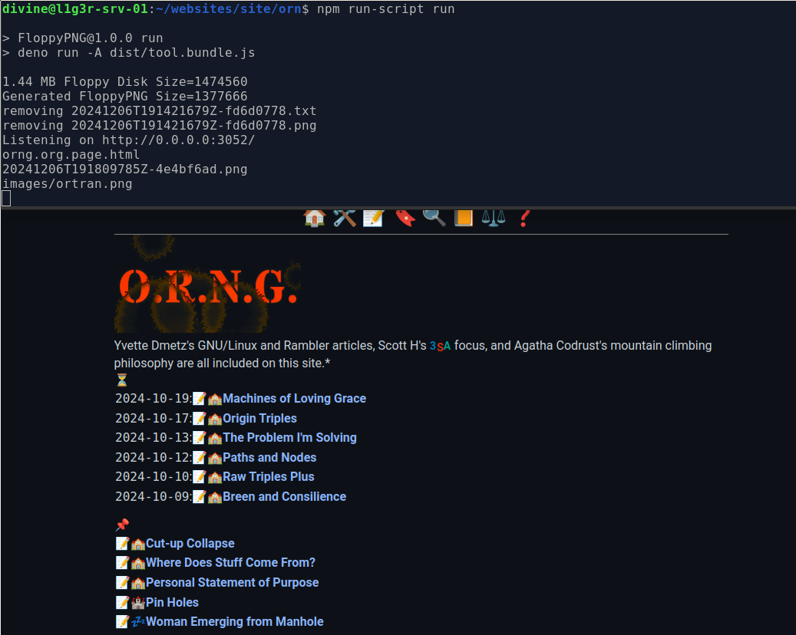

#Build code for orng.org

To install dependencies:  
npm install

To build and load up local web server:  
npm run-script run

It will look like this, assuming you have files and images

Files and images are available.  See ❓️ on orng.org.